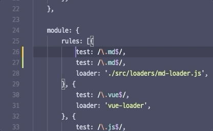

사람은 누구나 실수를 한다. 프로그래머도 사람이므로 마찬가지로 실수를 한다. 실수라고 해봐야 사실 별 볼 일 없는 것들이 대부분이지만 어쨌든 실수는 작게는 프로그래머 한 명을 패닉에 빠뜨릴 수 있고 심하게는 서비스 팀 전체가 장애대응 모드에 들게 만들 수 있다.


수만 명, 많게는 수십만, 수백만 명이 사용하는 서비스는 기도 메타로만 돌아갈 수 없기 때문에 이런 실수를 방지해 줄 여러 안전장치들이 필요해졌고 그렇게 해서 나오게 된 것이 **정적 분석**이다. 정적 분석이란, 코드를 실제로 실행하지 않고 코드, 혹은 바이너리 자체의 내용만으로 코드의 버그나 결함을 잡아내는 분석 방식을 말한다. 자바스크립트 진영에서는 `eslint`를 사실상 표준으로 사용하고 있다.

코드적인 냄새 외에도, 여러 명의 작업자가 한 코드베이스를 수정할 때 동일한 코드 스타일을 유지할 수 있는 방법도 고안되었다. 에디터 자체가 지원하는 기능을 사용해도 좋지만, 모든 에디터에서 같은 설정파일을 사용하기 위해 `eslint`와 마찬가지로 코드 포매팅을 전문으로 하는 라이브러리를 사용할 수 있다. 이 글에서는 `editorconfig`와 `prettier`에 대해서 설명할 예정이다.

# editorconfig

`editorconfig`는 언어에 상관 없이, 파일명 패턴만으로 파일의 인덴트 사이즈, 스페이스바 사용 여부 등 기초적인 코딩 스타일을 지정해 줄 수 있는 일종의 규약이다. 대부분의 에디터가 `editorconfig` 플러그인을 제공하므로, 해당 플러그인을 설치하면 어디서든 같은 코딩 스타일을 유지할 수 있다.


혹자는 이후 설명할 `prettier`를 사용하면 되는데 왜 `editorconfig`를 따로 사용하냐고 할 수도 있겠다. 일단 결론부터 말하자면 `prettier` 하나만 써도 결과적으로 같은 코드를 생산하기는 하지만 적용되는 시점이 다르기 때문에 둘 다 사용하는 것이 좋다. `prettier`는 저장 시점, 혹은 커밋 직전 시점에 마지막으로 코드를 포맷하는 것이고, `editorconfig`는 작성 시점에 일관적인 스타일을 제공한다고 생각하면 된다.

폴더 최상단에 `.editorconfig` 파일을 생성한 뒤, 아래 포맷에 맞추어 설정 파일을 작성한다.

```
[파일 패턴]
charset = utf-8
end_of_line = lf
# ...
```

파일 패턴은 우리가 유닉스에서 일반적으로 사용하는 와일드카드 패턴을 사용한다. 예를 들어 `*.js`는 폴더 내 모든 js 파일을 의미한다. 범용적으로 사용하는 옵션은 7개 + 루트 폴더 여부를 체크하는 옵션까지 총 8개이며, 그 이외에도 추가적인 옵션이 있지만 모든 에디터에서 동작을 보장하지는 않는다. 이후 설명할 `prettier`가 세밀한 포매팅 옵션을 추가로 제공하므로 여기에서는 범용 옵션만을 사용하자. [여기](https://github.com/editorconfig/editorconfig/wiki/EditorConfig-Properties)에서 전체 옵션 리스트를 확인할 수 있다.

# prettier

이렇게 해서 앞으로 작성할 코드에 대해서는 일관적인 스타일을 적용할 수 있게 되었다. 하지만 `editorconfig`는 이미 작성한 코드에 대한 스타일 교정은 지원하지 않는다.



이렇게, 이미 작성한 코드에 대해서 추가적으로 코드 포매팅을 적용하기 위해서, 또 자바스크립트만의 추가적인 규칙 지정을 위해서 `prettier`를 사용한다.

```sh
# 설치
npm i -D prettier

# prettier 설정 파일 추가
echo {} > .prettierrc.json
echo 'ignore-this-file.js' > .prettierignore

# 코드 포매팅
npx prettier --write .
```

`editorconfig`에 비하면 훨씬 많지만 `prettier`도 [옵션](https://prettier.io/docs/en/options.html) 자체는 그렇게 많지 않은 편이기 때문에 직접 읽어보면서 세팅해보기를 권한다.

## 파일별로 각각 다른 포맷을 지정하기

`prettier`도 `overrides` 속성을 이용해서 파일별로 각각 지정하고 싶은 포맷을 따로 지정해 줄 수 있다. 아래 설정 파일에서는 yaml/json 포맷의 파일에는 탭을 사용하지 않고, 나머지 파일에는 탭을 사용하도록 하고 있다.

```json
{
	"useTabs": true,
	"overrides": [{
		"files": ["*.json", "*.babelrc", "*.yml", "*.yaml"],
		"options": {
        	"useTabs": false
		}
	}]
}
```

# eslint

마지막으로 `eslint`를 세팅해보자. 앞서 설명했듯 `eslint`는 정적 분석 도구로 `prettier`나 `editorconfig` 같은 포매팅 툴과는 궤가 조금 다른데, 예를 들어 아래 코드를 보자.

```js
const a = 1
a = 2;
```

이런 코드가 있을 때, 코드에 세미콜론을 찍지 않았으니 세미콜론을 찍어주는 역할이 `prettier`라면, `const`로 선언된 변수가 변경되고 있다고 경고해 주는 것이 `eslint`이다. 역할이 다르므로 둘 다 사용해야 한다.

```sh
# 설치
npm i -D eslint
npm i -D eslint-config-prettier # eslint와 prettier를 함께 사용하는 경우 설치

# 최초 설정
npx eslint --init

# 실행
npx eslint .
```

lint는 설정이 워낙 방대해서 여기에 모든 케이스의 해결 방안에 대해서는 적을 수는 없다. 대신 내가 겪었던 케이스와 그 해결책을 몇 가지 공개해보려고 한다.


## eslint와 prettier를 함께 사용하기

앞서 `eslint`는 코드 정적 분석 도구라고 설명했는데, 정적 분석은 크게 보면 사실 코드 포매팅이 잘 되어있는지 평가하는 과정도 포함한다. 이 역할이 `prettier`와 중복되기 때문에, 둘 중 한 쪽의 설정을 무효화하는 과정이 필요하다. `prettier` 공식 문서에서 추천하는 방법은 `eslint-config-prettier`를 이용하여 `eslint`의 코드 포매팅 체크를 무효화하는 것이다.

```sh
npm i -D eslint-config-prettier
```

```json
{
	"extends": [
		"prettier"
	]
}
```

## jest와 함께 사용하기

`jest`는 여러 테스트 함수를 전역에 놓고 사용한다. `eslint`의 기본 설정은 미리 선언되지 않은 함수를 사용하는 것을 금지하고 있으므로 여기에서 에러가 발생한다(스크린샷의 `no-undef` 일부). 이를 해결하기 위해서는 플러그인을 하나 설치해햐 한다.

```sh
npm i -D eslint-plugin-jest
```

```json
{
	"env": {
		"jest/globals": true
	},
	"plugins": ["jest"]
}
```

## 전역 변수와 함께 사용하기

템플릿 엔진이나 `webpack.DefinePlugin` 등 js파일 외부에서 전역 변수를 선언하여 사용하는 경우 해당 전역변수가 선언되어 있지 않다는 오류를 뱉는다(스크린샷의 `IS_DEV` 관련 에러). 해당 변수가 전역변수이므로 외부에 선언되어 있다는 설정을 추가해 주면 해결된다.

```json
{
	"globals": {
		"IS_DEV": true
	}
}
```

## 체크하고 싶지 않은 설정 무효화하기

마지막으로 이 모든 경우에 해당하지 않으나 그냥 해당 규칙을 회피하고 싶은 경우이다. 나 같은 경우 함수 패러미터를 사용하지 않더라도 언젠가 사용할지 모르겠다는 생각이 들 때 그냥 남겨두는 편인데 `eslint` 추천 설정에서는 이것도 에러로 잡는다. 이 에러를 그냥 경고 표시로 바꿔보자.

에러 옆에 `no-unused-vars`라는 표시가 보이는가? 이 이름이 해당 에러를 일으키는 룰의 이름이다. [`eslint` 공식 홈페이지에서 해당 룰을 검색해 볼 수 있다.](https://eslint.org/docs/rules/no-unused-vars)

페이지에 들어가면, 해당 룰이 어떤 역할을 하는지, 어떤 코드에서 에러를 일으키고 어떤 코드일 때 정상적으로 통과하는지, 어떤 옵션을 줄 수 있고 이 옵션이 어떤 역할을 하는지가 자세히 설명되어 있다. 영어의 압박을 이겨낸다면 여러분에게 필요한 룰을 금방 익힐 수 있을 것이다.

다시 `no-unused-vars`로 돌아와서, 이 룰을 경고 표시로 바꾸고 몇 가지 옵션을 추가해 주자.

```json
{
	"rules": {
		"no-unused-vars": ["warn", { "vars": "all", "args": "after-used" }]
	}
}
```

에러의 레벨은 `off`, `warn`, `error`로 총 세 가지이며, 그 옆에 룰에 해당하는 옵션값을 전달하면 된다. 작성하지 않은 옵션은 기본값으로 들어간다.


이렇게 해서 모든 에러가 해결되었다.

# 정리

앞으로 이 레포에 접근 가능한 모든 유저가 같은 스타일의 코드를 유지하고, 장애가 발생하기 전에 그 요인을 최대한 줄일 수 있게 되었다. 코드베이스가 작을 때는 사람이 코드의 문제를 직접 추적하고 해결할 수 있지만, 코드의 규모가 커질수록 이런 도구의 도움 없이는 사전에 버그를 찾아내는 것이 점점 어려워진다. 자신이 개발 중인 기능의 규모가 크다면 이런 정적 분석 툴을 적극적으로 도입해보자.
